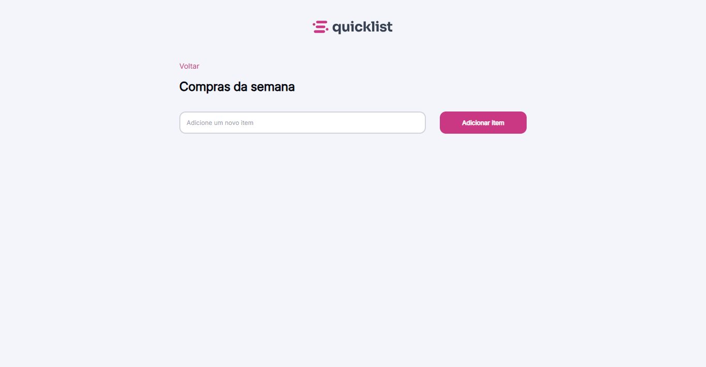

# Quicklist | Minhas Compras 🛒

 

Uma aplicação web simples, intuitiva e responsiva para gerenciamento de listas de compras. O projeto permite adicionar itens, marcá-los como concluídos e removê-los com feedback visual.

<div align="center">
  
</div>

## 🚀 Funcionalidades

- **Adicionar Itens:** Campo de entrada para registrar novos produtos na lista.
- **Marcar/Desmarcar:** Checkbox customizado para organizar o que já foi pego.
- **Remover Itens:** Botão de lixeira para excluir itens da lista.
- **Feedback Visual:** Exibição de um alerta temporizado (5 segundos) ao remover um item, com opção de fechamento manual.
- **Design Responsivo:** Layout adaptável para desktop e dispositivos móveis (mobile-first approach).

## 🛠️ Tecnologias Utilizadas

O projeto foi desenvolvido utilizando HTML5, CSS3 e JavaScript puro (Vanilla JS).

* **HTML5:** Estruturação semântica.
* **CSS3:**
    * Uso de **CSS Variables** (`:root`) para gerenciamento de cores e tipografia.
    * **Flexbox** para layout e alinhamento.
    * Estilização de inputs e botões com estados (`:hover`, `:focus`).
    * Design responsivo com `@media queries`.
* **JavaScript:**
    * Manipulação do DOM (`createElement`, `append`, `remove`).
    * Event Listeners (`submit`, `click`).
    * Lógica de `setTimeout` e `clearTimeout` para o alerta de remoção.
    * Delegação de eventos para manipular elementos criados dinamicamente.
* **Assets:** Ícones em SVG e fonte **Inter** (Google Fonts).

## 📂 Estrutura do Projeto

```text
/
├── index.html        # Estrutura principal da página
├── style.css         # Estilos e responsividade
├── script.js         # Lógica de funcionamento
└── assets/           # Imagens e ícones (logo, trash, check, alert, etc.)
